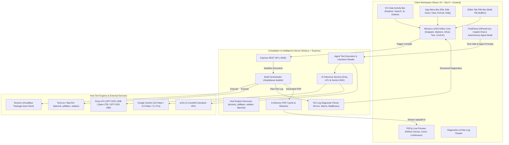

# 🗺️ ElseWhere Engineering Roadmap

> Tracking engineering milestones, completed architectural modules, and industrial-grade differentiators for **ElseWhere** — the high-performance, local-first collaborative LaTeX & research authoring suite.

---

## 📊 Milestone Tracker & Progress Overview

| Phase | Milestone | Focus Area | Status | Delivery Target |
| :--- | :--- | :--- | :---: | :---: |
| **Phase 0** | **Foundation & Scaffolding** | Vite 8 + React 19 + Monaco + PDF.js + Virtual VFS | `[COMPLETED]` | Delivered |
| **Phase 1** | **Compilation Engine & Diagnostics** | Node.js Sandboxes + Tectonic/Multi-Engine + Diagnostic Parser | `[COMPLETED]` | Delivered |
| **Phase 2** | **Design Token System** | Tailwind CSS v4 + Semantic `@theme` + Dark Theme | `[COMPLETED]` | Delivered |
| **Phase 3** | **Dual AI Copilot & VS Code Activity Bar** | Groq LPU + Gemini + VS Code Activity Bar + Multi-View Sidebar | `[COMPLETED]` | Delivered |
| **Phase 4** | **Agentic AI & Research Intelligence** | Dual-Mode ChatPanel + Autonomous Agent + Tool Calling + Reasoning + Base Paper Reading + Humanizer | `[IN PROGRESS]` | Q2 2026 |
| **Phase 5** | **Professional IDE Workspace & Navigation** | Application Menu Bar + Editor Tab Pills + Folder Tree + Outline Navigator + Settings Hub | `[IN PROGRESS]` | Q2 2026 |
| **Phase 6** | **Overleaf Industrial Differentiators** | AI Doctor, SyncTeX, Smart DOI/BibTeX, TikZ Studio, PDF Diff, Pandoc/Word Export | `[PLANNED]` | Q3 2026 |
| **Phase 7** | **Sandboxing, Decoupled Queue & WASM** | Docker/Firecracker, BullMQ + Redis, Client-side WASM TeX (Offline) | `[PLANNED]` | Q3 2026 |
| **Phase 8** | **Multiplayer CRDTs & Git Sync** | Yjs Real-Time Engine, Track Changes, GitHub Two-Way Sync | `[PLANNED]` | Q4 2026 |
| **Phase 9** | **Enterprise Identity & Production Scale** | PostgreSQL/Drizzle, ORCID/SAML SSO, RBAC, Kubernetes Helm | `[PLANNED]` | Q4 2026 |

---

## 🏗️ System Architecture Overview

---

## 🏁 Phase 0: Foundation & Core Scaffolding `[COMPLETED]`

- [x] **Monorepo Architecture**:
  - Concurrent development workflow orchestrating Vite client (`:3000`) and Express server (`:4000`).
  - Production-ready proxying in `vite.config.ts` routing `/api` traffic seamlessly to the backend.
- [x] **Modern Client Scaffolding**:
  - React 19 (`react: ^19.2.8`), Vite 8 (`vite: ^8.3.0`), TypeScript 6 (`typescript: ~6.0.2`), and Oxlint (`oxlint: ^1.81.0`).
  - Zustand 5 state management store with persistent local storage hydration (`useProjectStore.ts`, `useLayoutStore.ts`, `useAiStore.ts`).
- [x] **Monaco LaTeX Editor Core** (`MonacoLatexEditor.tsx`):
  - Custom LaTeX syntax tokenization with high-contrast theme matching.
  - Native snippet completions: `\begin{equation}`, `\begin{figure}`, `\begin{table}`, `\begin{itemize}`, `\begin{enumerate}`, `\cite`, `\ref`, `\section`, formatting (`\textbf`, `\textit`).
  - Essential editor keybindings: `⌘ + Enter` / `Ctrl + Enter` (Recompile), `⌘ + S` (Save & Compile), `⌘ + K` (AI Inline Prompt), `⌘ + B` (Toggle Sidebar), `⌘ + J` (Toggle Diagnostics).
  - Auto-compilation debounce timer option (1.5s idle recompile).
- [x] **Mozilla PDF.js Hardware-Accelerated Preview** (`PdfViewer.tsx`):
  - Continuous multi-page canvas rendering with high-DPI / Retina display device pixel ratio support.
  - Viewport zoom controls (Zoom In, Zoom Out, Fit to Width) and continuous page indicator.
  - Cache-busting PDF reload streaming and 1-click PDF download action.
- [x] **Overleaf-Style Resizable Layout** (`WorkspaceLayout.tsx`):
  - `react-resizable-panels` implementation featuring multi-view Sidebar, Monaco Editor, and PDF Live Preview with responsive drag handles.
- [x] **Virtual Project File System (VFS)** (`FileTree.tsx`):
  - Multi-file project support (`.tex`, `.bib`, `.sty`, `.cls`, `.json`).
  - Binary image asset upload (PNG, JPG, PDF) with inline image preview.
  - File create, rename, and delete safeguards (`main.tex` protection).
  - 1-click project export to `.zip` via `jszip` and `file-saver`.
- [x] **Starter Template Gallery** (`templates/index.ts`, `TemplateModal.tsx`):
  - **Academic Research Paper**: Standard journal/conference layout with abstract, equations, tables, and BibTeX.
  - **Professional Resume / CV**: ATS-friendly technical resume layout.
  - **Beamer Presentation**: Conference slide deck styling with Metropolis/Madrid structure.
  - **Minimal Starter**: Clean, lightweight scientific note template.

---

## ⚙️ Phase 1: Local & Server Compilation Pipeline `[COMPLETED]`

- [x] **Isolated Workspace Execution Sandbox** (`compiler.ts`):
  - Node.js compilation worker generating ephemeral build directories (`/tmp/latexer-builds/<uuid>`).
  - Path sanitization to prevent directory traversal attacks on uploaded filenames.
  - In-memory PDF streaming buffer cache (`pdfCache`) with automated 1-hour TTL garbage collection.
- [x] **Native Engine Auto-Discovery & Multi-Engine Dispatcher** (`compiler.ts`):
  - Host executable probing across system `$PATH` and macOS distribution paths (`/Library/TeX/texbin`, `/opt/homebrew/bin`, `/usr/local/texlive`).
  - Native runtime dispatching: **Tectonic**, **latexmk**, **pdflatex**, and **xelatex**.
  - Tectonic Cloudflare bundle caching for instant on-demand LaTeX package resolution.
  - Host engine setup guide modal (`HostSetupModal.tsx`) with Homebrew / MacTeX installation commands.
- [x] **Zero-Dependency Fallback PDF Generator** (`fallbackPdf.ts`):
  - Generates lightweight PDF document if no host compiler is installed, guiding the user to install Tectonic.
- [x] **Structured TeX Log Diagnostic Parser** (`logParser.ts`):
  - Parses raw terminal logs into structured errors, warnings, and bad box (`\hbox` / `\vbox`) records.
  - Extracts exact file context, line numbers (`l.<num>`), and code snippets.
- [x] **Monaco Diagnostic Marker Synchronization**:
  - Maps parser errors directly into Monaco squiggly underlines (`monaco.editor.setModelMarkers`).
  - Synchronized bottom diagnostic drawer (`LogsDrawer.tsx`) with category filtering (All, Errors, Warnings) and raw console view.
  - 1-Click **"Jump to Line"** action navigating Monaco directly to the offending line.

---

## 🎨 Phase 2: Design Token System & Tailwind CSS v4 `[COMPLETED]`

- [x] **Tailwind CSS v4 Integration**:
  - Configured `@tailwindcss/vite` v4 plugin with zero-runtime overhead.
  - Unified `@theme` design tokens in `index.css`:
    - Semantic brand accents: `--color-brand` (`#00b875`), `--color-brand-glow`, `--color-accent-blue`.
    - Surface elevations: `--color-app` (`#0b0f17`), `--color-sidebar`, `--color-editor`, `--color-preview`, `--color-card`.
    - Modern typography tokens: Google Fonts Inter (UI) & JetBrains Mono / Fira Code (Editor & Snippets).
- [x] **Modular Component Architecture**:
  - Replaced monolithic styling with atomic utility classes and scoped CSS modules.
  - Enterprise `cn()` utility in `client/src/lib/utils.ts` combining `clsx` and `tailwind-merge`.
  - Polished micro-interactions: smooth transitions, custom dark scrollbars, glowing status pills, and backdrop blur.

---

## 🤖 Phase 3: Dual AI Copilot, VS Code Activity Bar & Multi-View Sidebar `[COMPLETED]`

- [x] **Dual AI Engine Architecture (Groq LPU & Google Gemini)** (`aiService.ts`, `aiApi.ts`, `useAiStore.ts`):
  - **Groq LPU Ultra-Fast Acceleration**: Sub-300ms completion speeds (~250+ tokens/sec) for publication-grade grammar, academic writing, and LaTeX equations via **GPT-OSS 120B** (`openai/gpt-oss-120b`), **Qwen 3.8 27B** (`qwen/qwen3.8-27b`), and **GPT-OSS 20B** (`openai/gpt-oss-20b`).
  - **Google Gemini Engine**: Native support for **Gemini 3.8 Flash**, **Gemini 3.6 Flash**, and **Gemini 3.1 Pro**.
  - Clean API key management: untracked `.env` backend keys with client override capability in `localStorage`.
- [x] **VS Code-Style Activity Bar Rail** (`ActivityBar.tsx`):
  - 46px leftmost vertical navigation rail.
  - Quick-switch view icons:
    - 📁 **File Explorer** (`⌘⇧E` / `Ctrl+Shift+E`) with live project file-count badge.
    - 🔍 **Search in Project** (`⌘⇧F` / `Ctrl+Shift+F`) with global search and replace across virtual files.
    - ✨ **AI Copilot** with active model indicator pill.
    - 📑 **Document Outline** (`ListTree`) with structural LaTeX element parser.
    - ⚙️ **Settings Gear** at the bottom rail opening the engine & AI settings dialog.
- [x] **Multi-View Sidebar Panels**:
  - `SearchPanel.tsx`: Full-text search and replace across all project files with case-sensitivity, file match grouping, and click-to-jump to editor line.
  - `OutlinePanel.tsx`: Parsed LaTeX outline (`\section`, `\subsection`, `table`, `figure`, `equation`) with line jump navigation.
  - `AiPanel.tsx`: Dedicated sidebar AI view with quick action chips (*Fix Errors*, *Academic Polish*, *Add Comments*) and 1-click Monaco insertion.
- [x] **Inline AI Command Palette (`⌘ + K`)** (`InlineCommandPalette.tsx`):
  - Floating Monaco overlay triggered anywhere in the document.
  - Selection-aware prompt execution: replaces selected code with refined LaTeX or generates new sections at the cursor in <250ms via Groq.
- [x] **Streamlined Top Title Bar** (`TopNav.tsx`):
  - Cleaned up duplicate and redundant buttons for a sleek, uncluttered header experience.

---

## 🧠 Phase 4: Agentic Intelligence, Research Synthesis & Writing Humanization `[IN PROGRESS]`

### 4.1 ChatPanel Architecture & Dual-Mode AI Workspace (`AiPanel.tsx`) `[IN PROGRESS]`
- [x] **Dual-Mode Switcher Interface**:
  - Segmented toggle switching between **⚡ Agent Mode** and **💬 Copilot Chat Mode**.
  - Provider & model indicator badges (Groq LPU / Google Gemini with model short name).
  - Header actions: Clear History (context-dependent for Chat vs. Agent) and AI Settings dialog launcher.
- [ ] **Copilot Chat Interface & Formatting**:
  - [x] Multi-turn conversational history maintaining author-copilot dialogue.
  - [x] Interactive LaTeX code cards with syntax badges, copy button, and 1-click Monaco cursor insertion (`insertAtCursor`).
  - [x] 4 one-click starter quick action chips (*Polish Academic Tone*, *Add Math Equation*, *Create Table*, *Fix LaTeX Errors*).
  - [x] **Rich Markdown Message Renderer**: Render bold, italics, bullet lists, numbered lists, headings, and inline math/code instead of raw markdown characters.
  - [ ] **Auto-Resizing Composer Textarea**: Dynamic height expansion up to 160px with `Enter` (send) and `Shift + Enter` (newline) handling.
  - [ ] **Dynamic Provider Placeholders & Sender Metadata**: Contextual placeholders matching active engine and immutable provider branding on message bubbles.
  - [ ] **Document Context & Selection Toggle**: Toggle switch for `[x] Include Document Context` and active selection line-count badge.
  - [ ] **Thread Persistence**: Store recent conversation history in `localStorage` so chats survive browser refreshes.
- [x] **Autonomous Agent Workspace UI**:
  - [x] Goal composer with pre-configured task chips (*Fix Errors*, *Booktabs Tables*, *BibTeX Citations*, *Math Appendix*).
  - [x] Clean user message box and direct agent response card (no redundant headers or emoji clutter).
  - [x] Interactive tool call cards displaying tool icon, execution state badges (`running`, `success`, `error`), and error diagnostics.
  - [x] Live syntax diff cards showing surgical file modifications (`- target` / `+ replacement`).
  - [x] Step progress counter (`Step X/10`) with live execution footer.
  - [ ] **Execution Cancellation & Status Badges**: `AbortController` integration with responsive `Stopped` / `Aborted` state indicators.
  - [ ] **Expandable Tool Data Inspector**: Collapsible drawer revealing returned search results, line numbers, and raw compiler diagnostic logs.

### 4.2 Autonomous Agent Mode & Prompt Architecture (`prompts.ts`) `[COMPLETED]`
- [x] **Modular Prompt Architecture (`prompts.ts`)**:
  - Domain-specific prompt generators inspired by modern AI IDE architectures (`buildAgentSystemPrompt`, `buildChatSystemPrompt`, `buildInlineEditPrompt`).
  - Dynamic `<workspace_context>` injection (active file, open files list, compiler engine).
  - **Fast-Path Intent Detection**: Zero tool calls for greetings (*"hi"*, *"who are you"*) and conceptual/academic queries; direct friendly responses without over-inspecting the workspace.
  - **Anti-Narration Rule**: Prohibits routine narration ("I will now call read_file") to keep agent execution clean and direct.
  - **Reasoning Isolation**: Internal model reasoning (`choice.message.reasoning`) is decoupled from user-facing `content`, preventing monologue leaks into chat bubbles.
- [x] **Autonomous Goal Execution**:
  - Autonomous Agent mode capable of breaking down high-level manuscript and coding goals across the workspace.
  - Iterative `Plan ➔ Act ➔ Observe ➔ Reflect ➔ Verify` execution cycle (up to 10 sequential steps).
- [ ] **Interactive Execution Plan Preview**:
  - Displays proposed step-by-step roadmap of file edits before modifying workspace files.
  - Allows user approval, step rejection, or single-step execution checkpoints.
- [x] **Automated Test-Compile & Self-Correction**:
  - Automatically triggers compilation via `compile_and_diagnose` after writing code.
  - Inspects compiler diagnostic logs; if syntax errors or missing packages occur, autonomously patches files until the project compiles with 0 errors.

### 4.3 Agent Tool Calling Suite for Workspace File Manipulation `[COMPLETED]`
- [x] Standardized structured Tool Calling API (Groq function calling & Gemini tool declarations):
  - `list_files`: Scan virtual project tree and asset metadata.
  - `read_file(path, start_line?, end_line?)`: Read file contents or line slices.
  - `write_file(path, content)`: Create new files or overwrite existing files.
  - `edit_file(path, target_snippet, replacement_snippet)`: Surgical diff/replacement edits.
  - `delete_file(path)`: Safe file deletion (`main.tex` protected).
  - `search_files(query, case_sensitive?)`: Project-wide grep search across all text files.
  - `compile_and_diagnose(engine?)`: Trigger build and return structured diagnostics to the agent.
- [x] Interactive tool execution badges in the AI sidebar with status chips, result messages, and live diff previews.

### 4.4 Deep Reasoning & Extended Thinking Capacity `[TODO]`
- [ ] Support for flagship reasoning models:
  - **DeepSeek-R1**, **QwQ-32B**, **Gemini 2.0 Flash Thinking**, and Groq reasoning endpoints.
- [ ] **Collapsible Thinking Trace UI Component**:
  - Render thought processes inside an expandable `<ThinkingTrace>` component with real-time streaming pulses.
  - Separates internal reasoning (mathematical derivations, proof strategies, structural planning) from the final generated LaTeX code.
- [ ] Configurable reasoning effort (Low / Medium / High / Deep) in the AI settings modal.

### 4.5 Literature Understanding: Multi-Modal PDF & Base Paper Ingestion `[TODO]`
- [ ] **Multi-Modal Research Paper Ingestion**:
  - Dedicated "Reference Papers" drop zone in the workspace: upload base research PDFs (e.g., arXiv downloads, conference papers).
  - Server-side PDF extraction parsing text, equations, tables, and references from uploaded base papers.
- [ ] **Literature Review & Grounded Manuscript Writing**:
  - Ground AI responses on uploaded papers to draft Literature Reviews and Related Work sections with zero hallucinations.
  - Automatic extraction of baseline data to build comparative benchmark tables (`booktabs`).
  - Extract and format cited papers directly into clean BibTeX entries appended to `references.bib`.

### 4.6 Ghost Text AI Inline Code Completions `[COMPLETED]`
- [x] Monaco `InlineCompletionsProvider` delivering real-time gray phantom text as the author types.
- [x] Ultra-fast debounced generation (~150ms via Groq LPU fast inference / Google Gemini).
- [x] Predicts equation completions, math symbols, `\item` enumerations, and academic sentence continuations.
- [x] Standard editor shortcuts: `Tab` to accept ghost text, `Esc` to dismiss, `⌥\` / `Alt+\` to trigger. Copilot toggle badge in editor toolbar.

### 4.7 AI Writing Detection Analysis & Academic Humanizer Engine `[TODO]`
- [ ] **AI Writing Detection Scanner**:
  - Real-time sentence-level perplexity and burstiness evaluator.
  - Visual heatmap overlay highlighting robotic, repetitive, or formulaic sentences.
  - Overall originality / human-writing score indicator.
- [ ] **Academic Humanizer Engine**:
  - 1-Click **"Humanize Selection"** action.
  - Strips synthetic AI clichés (*"delve into"*, *"testament to"*, *"pivotal role"*, *"moreover"*, *"furthermore"*, *"in conclusion"*).
  - Rewrites text with authentic academic rhythm, varied sentence lengths, natural signposting, and field-appropriate scientific vocabulary while strictly preserving technical accuracy and LaTeX math environments.

---

## 🖥️ Phase 5: Professional IDE Workspace, Application Menu & Settings Hub `[IN PROGRESS]`

### 5.1 Desktop Application Menu Bar (`File`, `Edit`, `Insert`, `View`, `Format`, `Help`) `[TODO]`
- [ ] Desktop-grade application menu bar with dropdown menus and keyboard accelerators:
  - **File**: New File, New Folder, Upload File, Upload Image, Download PDF, Export ZIP, Project Settings.
  - **Edit**: Undo (`⌘Z`), Redo (`⌘⇧Z`), Find (`⌘F`), Replace (`⌘H`), Select All (`⌘A`), Format Document (`⌥⇧F`).
  - **Insert**: Section, Equation (`align`), Figure (`graphicx`), Table (`booktabs`), Citation (`\cite`), Math Symbol, Algorithm.
  - **View**: Toggle Activity Bar, Toggle Sidebar (`⌘B`), Toggle Logs Drawer (`⌘J`), Split / Editor-Only / Preview-Only, Zoom In/Out.
  - **Format**: Bold (`⌘B`), Italic (`⌘I`), Underline, Inline Math (`$`), Display Math (`$$`), Toggle Comment (`⌘/`), Indent/Outdent.
  - **Help**: LaTeX Cheat Sheet, Keyboard Shortcuts Modal, TeX Engine Status, Documentation, About Latexer.

### 5.2 Opened File Tab Pills Bar (Multi-File Editor Tabs) `[TODO]`
- [ ] Multi-file tab bar positioned above the Monaco LaTeX editor:
  - Displays file pill tabs for all active files (`main.tex`, `references.bib`, `custom.sty`).
  - Active tab highlight with distinct border and background tokens.
  - Dirty state indicator (`•` dot) indicating unsaved / modified buffer.
  - Tab interactions: close tab (`×`), pin tab, drag-and-drop tab reordering, close other tabs, close tabs to the right.
  - Shortcuts: `⌘W` to close active tab, `⌘1`–`⌘9` / `Ctrl+Tab` for rapid tab cycling.

### 5.3 Hierarchical Folders & Directory Creation in VFS `[TODO]`
- [ ] Support nested directory hierarchies in the Virtual File System (e.g., `chapters/intro.tex`, `figures/diagram.png`, `styles/macros.sty`).
- [ ] **Folder Operations**:
  - "New Folder" icon and context menu option in the File Explorer panel.
  - Collapsible tree view with persistent expansion states.
  - Drag-and-drop file organization (move files into folders).
- [ ] **Compiler Sandbox Path Preservation**:
  - Compiler worker preserves relative folder structures so `\input{chapters/intro}` and `\includegraphics{figures/diagram}` compile seamlessly without path errors.

### 5.4 Advanced Document Outline & Section Tree Navigator `[TODO]`
- [ ] Hierarchical document structure parser supporting:
  - Structural levels: `\part`, `\chapter`, `\section`, `\subsection`, `\subsubsection`, `\paragraph`.
  - Floating environments: `\begin{table}` (with `\caption`), `\begin{figure}`, `\begin{equation}` (with `\label`), theorems, lemmas.
- [ ] **Interactive Outline Navigation**:
  - Click-to-jump navigation scrolling Monaco directly to the section definition.
  - Active section highlight following the editor cursor position in real time.
  - Structural drag-and-drop: dragging a subsection in the outline automatically reorders the underlying LaTeX block in the file.

### 5.5 Comprehensive Multi-Category Settings Hub `[TODO]`
- [ ] Unified, tabbed Settings dialog with deep customization categories:
  - **Editor**: Font family (Fira Code, JetBrains Mono, Inter), font size, ligatures, line wrapping, line numbers, minimap toggle, tab size, cursor style, bracket pair colorization.
  - **Spelling & Language**: LTeX / LanguageTool grammar check, UK English vs. US English dictionaries, custom user dictionary for scientific terms, LaTeX-aware spell checking (ignores math and commands).
  - **Compiler**: Default engine selection, custom compiler flags, compile timeout (s), auto-compile debounce delay, shell-escape policy, SyncTeX generation flag.
  - **AI Models & Intelligence**: API keys (Groq, Gemini, OpenAI, Claude, local Ollama), default model selector, temperature slider, reasoning effort, custom system prompt/persona, fallback provider.
  - **Keybindings & Shortcuts**: Interactive keyboard shortcuts viewer and custom remapping table.

---

## 🚀 Phase 6: Overleaf Industrial Differentiators `[PLANNED]`

### 6.1 AI Error Doctor (1-Click Auto-Patching) `[TODO]`
- [ ] Add a **"✨ Fix with AI"** button on every diagnostic card in `LogsDrawer.tsx`.
- [ ] Send compiler diagnostic, error snippet, faulty line number, and surrounding 30 lines of code to the AI.
- [ ] Compute minimal replacement hunk and display an interactive diff modal (Before vs. After).
- [ ] 1-Click **"Apply Fix & Recompile"** updating Monaco buffer and triggering an immediate test build.

### 6.2 SyncTeX Bi-Directional Forward & Inverse Navigation `[TODO]`
- [ ] **Build Pipeline Flag**: Enable `--synctex=1` across compilation runs and parse generated `.synctex.gz`.
- [ ] **Forward Search (Editor ➔ PDF)**: `⌘ + Click` on any line in Monaco editor scrolls PDF.js and highlights the target paragraph.
- [ ] **Inverse Search (PDF ➔ Editor)**: `⌘ + Click` on the rendered PDF preview switches Monaco to the source file and scrolls to line.

### 6.3 Smart Bibliography & DOI / arXiv Auto-Fetcher `[TODO]`
- [ ] Quick fetch modal accepting DOI, arXiv ID/URL, or ISBN.
- [ ] Queries CrossRef REST API and arXiv API; transforms response into clean BibTeX entries appended to `references.bib`.
- [ ] Rich citation autocomplete in Monaco: dropdown displays paper title, first author, publication year, and abstract preview.

### 6.4 Isolated Live TikZ & PGFPlots Studio `[TODO]`
- [ ] Dedicated playground isolating `\begin{tikzpicture}` blocks into lightweight standalone templates.
- [ ] Micro-compilation (<100ms) directly to standalone vector SVG or PDF preview.
- [ ] Export diagram directly as standalone `.svg`, `.pdf`, or high-resolution `.png`.

### 6.5 Visual Rendered PDF Diffing `[TODO]`
- [ ] Compare rendered PDF pages between compilation builds, saved checkpoints, or git commits.
- [ ] Visual overlay: highlights added paragraphs/equations in emerald green and deleted items in crimson red directly on the PDF pages.
- [ ] Toggle between split side-by-side mode and opacity slider overlay mode.

### 6.6 Multi-Format Publishing Engine (Pandoc / Quarto) `[TODO]`
- [ ] Export project to Microsoft Word (`.docx`) for non-LaTeX co-authors and journal reviewers.
- [ ] Export to clean GitHub Flavored Markdown (`.md`) and interactive HTML5 research article with KaTeX math rendering.
- [ ] Import from Markdown / Docx into native LaTeX workspace.

---

## 🛡️ Phase 7: Sandboxing, Decoupled Queue & WebAssembly `[PLANNED]`

### 7.1 Rootless Compute Sandboxing
- [ ] Ephemeral rootless Docker containers or Firecracker MicroVMs for untrusted user code compilation.
- [ ] Strict isolation flags: `--net=none`, memory limit (512MB), CPU quota (1 core), strict timeout (30s).
- [ ] Enforce `--untrusted` / `-no-shell-escape` preventing unauthorized host process execution.
- [ ] In-memory `tmpfs` mounts ensuring zero persistent artifact leakage.

### 7.2 WebAssembly (WASM) Zero-Server In-Browser Compilation
- [ ] Integrate WebAssembly TeX engine (e.g. Wasm Tectonic / SwiftLaTeX) running inside a Web Worker.
- [ ] Enables **100% offline, zero-server, private compilation** directly inside the user's browser without requiring any local backend or CLI installation.

### 7.3 Decoupled Job Queue & Content-Addressable Storage (CAS)
- [ ] **BullMQ + Redis**: Asynchronous job queue decoupling user-facing HTTP servers from TeX worker pools.
- [ ] **CAS Caching**: Compute SHA-256 hashes of source files; if hash matches prior build, return cached PDF instantly in 0ms.
- [ ] Cloudflare R2 / AWS S3 object storage for persistent PDF artifacts, project bundles, and figure assets.

---

## 👥 Phase 8: Multiplayer Real-Time Collaboration & Git Sync `[PLANNED]`

### 8.1 Yjs CRDT Synchronization Engine
- [ ] Integrate **Yjs** CRDTs with `y-monaco` and WebSocket / WebRTC signaling server.
- [ ] Real-time multi-user typing with sub-50ms latency.
- [ ] Colored live user cursors, presence avatars, and selection highlights in Monaco editor.

### 8.2 Track Changes & Review Mode
- [ ] Suggestion mode: visual inline additions (green) and deletions (red strike-through).
- [ ] Author Accept / Reject diff controls per hunk.
- [ ] Threaded inline comments anchored to specific lines with `@mention` notifications.

### 8.3 Bi-Directional Git Synchronization
- [ ] Virtualized Git repository per project with commit history graph.
- [ ] Two-way GitHub and GitLab repository synchronization (push, pull, conflict resolution).

---

## 🏢 Phase 9: Enterprise Identity, Governance & Cloud Scale `[PLANNED]`

### 9.1 Database & Persistence
- [ ] PostgreSQL database with Drizzle ORM managing Users, Organizations, Workspaces, and Projects.
- [ ] Comprehensive audit logging and project version snapshots.

### 9.2 Identity & Role-Based Access Control (RBAC)
- [ ] Granular workspace permissions: **Owner**, **Maintainer**, **Author**, **Reviewer**, **Viewer**.
- [ ] Academic Single Sign-On (SSO): ORCID OAuth, Google Workspace, and Shibboleth / SAML / EduGAIN.

### 9.3 Production Orchestration & Observability
- [ ] Production deployment orchestration:
  - `docker-compose.prod.yml` (Nginx, API server, TeX workers, PostgreSQL, Redis, MinIO).
  - Production Kubernetes Helm charts with horizontal pod autoscaling (HPA) for TeX workers.
- [ ] Full-stack observability: Prometheus metrics, Grafana dashboards, OpenTelemetry distributed tracing, and Sentry error monitoring.
