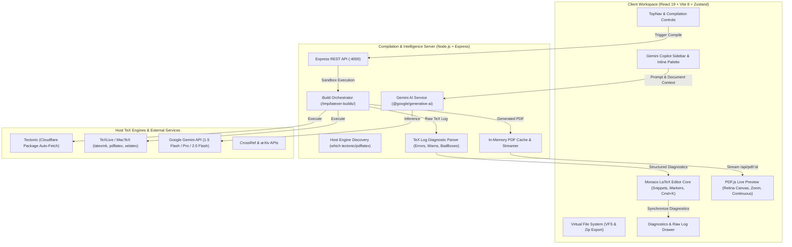

# 🗺️ Latexer Engineering Roadmap

> Tracking engineering milestones, completed architectural modules, and industrial-grade differentiators for **Latexer** — the high-performance, local-first collaborative LaTeX authoring suite.

---

## 📊 Milestone Tracker & Progress Overview

| Phase | Milestone | Focus Area | Status | Delivery Target |
| :--- | :--- | :--- | :---: | :---: |
| **Phase 0** | **Foundation & Scaffolding** | Vite 8 + React 19 + Monaco + PDF.js + Virtual VFS | `[COMPLETED]` | Delivered |
| **Phase 1** | **Compilation Engine & Diagnostics** | Node.js Sandboxes + Tectonic/Multi-Engine + Diagnostic Parser | `[COMPLETED]` | Delivered |
| **Phase 2** | **Design Token System** | Tailwind CSS v4 + Semantic `@theme` + Dark Theme | `[COMPLETED]` | Delivered |
| **Phase 3** | **AI Copilot & Inline Intelligence** | Gemini 1.5/2.0 + Contextual Chat + `⌘K` Inline Editing | `[COMPLETED]` | Delivered |
| **Phase 4** | **Overleaf Industrial Differentiators** | AI Doctor, SyncTeX, Smart DOI/BibTeX, TikZ Studio, PDF Diff | `[IN PROGRESS]` | Q2 2026 |
| **Phase 5** | **Sandboxing, Decoupled Queue & WASM** | Docker/Firecracker, BullMQ + Redis, Client-side WASM TeX | `[PLANNED]` | Q3 2026 |
| **Phase 6** | **Multiplayer CRDTs & Git Sync** | Yjs Real-Time Engine, Track Changes, GitHub Two-Way Sync | `[PLANNED]` | Q3 2026 |
| **Phase 7** | **Enterprise Identity & Production Scale** | PostgreSQL/Drizzle, ORCID/SAML SSO, RBAC, Kubernetes Helm | `[PLANNED]` | Q4 2026 |

---

## 🏗️ System Architecture Overview

---

## 🏁 Phase 0: Foundation & Core Scaffolding `[COMPLETED]`

- [x] **Monorepo Architecture**:
  - Concurrent development workflow orchestrating Vite client (`:3000`) and Express server (`:4000`).
  - Production-ready proxying in `vite.config.ts` routing `/api` traffic seamlessly to the backend.
- [x] **Modern Client Scaffolding**:
  - React 19 (`react: ^19.2.8`), Vite 8 (`vite: ^8.3.0`), TypeScript 6 (`typescript: ~6.0.2`), and Oxlint (`oxlint: ^1.81.0`).
  - Zustand 5 state management store with persistent local storage hydration (`useProjectStore.ts`).
- [x] **Monaco LaTeX Editor Core** (`MonacoLatexEditor.tsx`):
  - Custom LaTeX syntax tokenization with high-contrast theme matching.
  - Native snippet completions: `\begin{equation}`, `\begin{figure}`, `\begin{table}`, `\begin{itemize}`, `\begin{enumerate}`, `\cite`, `\ref`, `\section`, formatting (`\textbf`, `\textit`).
  - Essential editor keybindings: `⌘ + Enter` / `Ctrl + Enter` (Recompile), `⌘ + S` (Save & Compile), `⌘ + K` (Gemini Inline Prompt).
  - Auto-compilation debounce timer option (1.5s idle recompile).
- [x] **Mozilla PDF.js Hardware-Accelerated Preview** (`PdfViewer.tsx`):
  - Continuous multi-page canvas rendering with high-DPI / Retina display device pixel ratio support.
  - Viewport zoom controls (Zoom In, Zoom Out, Fit to Width) and continuous page indicator.
  - Cache-busting PDF reload streaming and 1-click PDF download action.
- [x] **Overleaf-Style 3-Panel Resizable Layout** (`App.tsx`):
  - `react-resizable-panels` implementation featuring File Tree (18%), Monaco Editor (42%), and PDF Live Preview (40%) with responsive drag handles.
- [x] **Virtual Project File System (VFS)** (`FileTree.tsx`):
  - Multi-file project support (`.tex`, `.bib`, `.sty`, `.cls`, `.json`).
  - Binary image asset upload (PNG, JPG, PDF) with inline image preview.
  - File create, rename, and delete safeguards (`main.tex` protection).
  - 1-click project export to `.zip` via `jszip` and `file-saver`.
- [x] **Starter Template Gallery** (`templates/index.ts`, `TemplateModal.tsx`):
  - **Academic Research Paper**: Standard journal/conference layout with abstract, equations, tables, and BibTeX.
  - **Professional Resume / CV**: ATS-friendly technical resume layout.
  - **Beamer Presentation**: Conference slide deck styling with Metropolis/Madrid structure.
  - **Minimal Starter**: Clean, lightweight scientific note template.

---

## ⚙️ Phase 1: Local & Server Compilation Pipeline `[COMPLETED]`

- [x] **Isolated Workspace Execution Sandbox** (`compiler.ts`):
  - Node.js compilation worker generating ephemeral build directories (`/tmp/latexer-builds/<uuid>`).
  - Path sanitization to prevent directory traversal attacks on uploaded filenames.
  - In-memory PDF streaming buffer cache (`pdfCache`) with automated 1-hour TTL garbage collection.
- [x] **Native Engine Auto-Discovery & Multi-Engine Dispatcher** (`compiler.ts`):
  - Host executable probing across system `$PATH` and macOS distribution paths (`/Library/TeX/texbin`, `/opt/homebrew/bin`, `/usr/local/texlive`).
  - Native runtime dispatching: **Tectonic**, **latexmk**, **pdflatex**, and **xelatex**.
  - Tectonic Cloudflare bundle caching (`https://data1b.fullyjustified.net/...`) for instant on-demand LaTeX package resolution.
  - Host engine setup guide modal (`HostSetupModal.tsx`) with Homebrew / MacTeX installation commands.
- [x] **Zero-Dependency Fallback PDF Generator** (`fallbackPdf.ts`):
  - Generates lightweight PDF document if no host compiler is installed, guiding the user to install Tectonic.
- [x] **Structured TeX Log Diagnostic Parser** (`logParser.ts`):
  - Parses raw terminal logs into structured errors, warnings, and bad box (`\hbox` / `\vbox`) records.
  - Extracts exact file context, line numbers (`l.<num>`), and code snippets.
- [x] **Monaco Diagnostic Marker Synchronization**:
  - Maps parser errors directly into Monaco squiggly underlines (`monaco.editor.setModelMarkers`).
  - Synchronized bottom diagnostic drawer (`LogsDrawer.tsx`) with category filtering (All, Errors, Warnings) and raw console view.
  - 1-Click **"Jump to Line"** action navigating Monaco directly to the offending line.

---

## 🎨 Phase 2: Design Token System & Tailwind CSS v4 `[COMPLETED]`

- [x] **Tailwind CSS v4 Integration**:
  - Configured `@tailwindcss/vite` v4 plugin with zero-runtime overhead.
  - Unified `@theme` design tokens in `index.css`:
    - Semantic brand accents: `--color-brand` (`#00b875`), `--color-brand-glow`, `--color-accent-blue`.
    - Surface elevations: `--color-app` (`#0b0f17`), `--color-sidebar`, `--color-editor`, `--color-preview`, `--color-card`.
    - Modern typography tokens: Google Fonts Inter (UI) & JetBrains Mono / Fira Code (Editor & Snippets).
- [x] **Modular Component Architecture**:
  - Replaced monolithic styling with atomic utility classes and scoped CSS modules.
  - Enterprise `cn()` utility in `client/src/lib/utils.ts` combining `clsx` and `tailwind-merge`.
  - Polished micro-interactions: smooth transitions, custom dark scrollbars, glowing status pills, and backdrop blur.

---

## 🤖 Phase 3: AI Copilot & Inline Intelligence `[COMPLETED]`

- [x] **Dual AI Engine Architecture (Groq LPU & Google Gemini)** (`aiService.ts`, `aiApi.ts`, `useAiStore.ts`):
  - **Groq LPU High-Speed Acceleration**: Near-instant inference (~250+ tokens/sec) specialized in publication-grade English grammar, academic rewriting, and LaTeX syntax using **GPT-OSS 120B** (`openai/gpt-oss-120b`), **Qwen 3.8 27B** (`qwen/qwen3.8-27b`), and **GPT-OSS 20B**.
  - **Google Gemini Integration**: Native support for **Gemini 1.5 Flash**, **Gemini 1.5 Pro**, and **Gemini 2.0 Flash**.
  - Persistent server configuration via `server/.env` (`GROQ_API_KEY`) with client-side override in `localStorage`.
- [x] **AI Copilot Sidebar** (`AiSidebar.tsx`):
  - Multi-turn conversational chat with automatic document context injection.
  - One-click quick action chips (*Polish Tone*, *Table*, *Math Equation*, *TikZ Graphic*).
  - Code block renderer with syntax highlighting, one-click copy, and one-click **"Insert"** at Monaco cursor position.
  - Dynamic model pill reflecting active provider and model name.
- [x] **Inline AI Command Palette (`⌘ + K`)** (`InlineCommandPalette.tsx`):
  - Floating Monaco overlay triggered anywhere in the document.
  - Selection-aware prompt execution: replaces selected code with refined LaTeX or generates new sections at the cursor in <250ms via Groq.
- [x] **AI Configuration Modal** (`AiSettingsModal.tsx`):
  - Segmented provider switcher tabs (**Groq LPU** vs **Google Gemini**).
  - Manage API keys, select preferred models, and verify server configuration status.

---

## 🚀 Phase 4: Industrial Differentiators (Overleaf Gaps) `[IN PROGRESS]`

### 4.1 AI Error Doctor (1-Click Auto-Patching) `[TODO]`
- [ ] Add a **"✨ Fix with AI"** button on every diagnostic card in `LogsDrawer.tsx`.
- [ ] Send compiler diagnostic, error snippet, faulty line number, and surrounding 30 lines of code to Gemini.
- [ ] Compute minimal replacement hunk and display an interactive diff modal (Before vs. After).
- [ ] 1-Click **"Apply Fix & Recompile"** updating Monaco buffer and triggering an immediate test build.

### 4.2 SyncTeX Bi-Directional Forward & Inverse Navigation `[TODO]`
- [ ] **Build Pipeline Flag**: Enable `--synctex=1` across compilation runs and parse generated `.synctex.gz`.
- [ ] **Forward Search (Editor ➔ PDF)**:
  - Keybinding `⌘ + Click` on any line in Monaco editor.
  - Calculates page number and coordinate box; PDF.js scrolls smoothly and draws a temporary highlighting ring/box around the target paragraph.
- [ ] **Inverse Search (PDF ➔ Editor)**:
  - `⌘ + Click` anywhere on the rendered PDF preview canvas.
  - Resolves source file and line number; Monaco switches to the target file, scrolls to line, and places the cursor.

### 4.3 Smart Bibliography & DOI / arXiv Auto-Fetcher `[TODO]`
- [ ] **Quick Fetch Modal & Shortcut**:
  - Modal accepting DOI (e.g., `10.1145/3318464.3389700`), arXiv URL / ID (e.g., `arxiv:1706.03762`), or ISBN.
  - Query CrossRef REST API and arXiv API; transform response into clean, standardized BibTeX entries.
  - Deduplicate citation keys against existing entries and automatically append to `references.bib`.
- [ ] **Rich Citation Autocomplete**:
  - Monaco completion provider for `\cite{...}` reading `references.bib`.
  - Dropdown displays paper title, first author, publication year, journal, and abstract preview.

### 4.4 Isolated Live TikZ & PGFPlots Studio `[TODO]`
- [ ] **Dedicated TikZ Drawer / Playground**:
  - Isolate active `\begin{tikzpicture} ... \end{tikzpicture}` block into a lightweight standalone template wrapper.
  - Micro-compilation (<100ms) directly to standalone vector SVG or PDF preview.
  - Prevents waiting 5-10 seconds to recompile a 60-page paper just to tweak diagram coordinates.
- [ ] **Export Options**: Export diagram directly as standalone `.svg`, `.pdf`, or high-resolution `.png`.

### 4.5 Visual Rendered PDF Diffing `[TODO]`
- [ ] **Side-by-Side & Overlay Diff Viewer**:
  - Compare rendered PDF pages between compilation builds, saved checkpoints, or git commits.
  - Visual overlay: highlights added paragraphs/equations in emerald green and deleted items in crimson red directly on the PDF pages.
  - Toggle between split side-by-side mode and opacity slider overlay mode.

### 4.6 Language Server Protocol (TexLab LSP Integration) `[TODO]`
- [ ] Connect Monaco to a background `texlab` language server via WebSocket (`monaco-languageclient`).
- [ ] **Semantic IntelliSense**:
  - Go to Definition / Hover for `\ref`, `\label`, `\cite`, `\input`, and `\include`.
  - Interactive Table of Contents (ToC) outline navigation panel.
  - Workspace-wide safe symbol rename (renaming `\label{sec:intro}` updates all `\ref{sec:intro}`).

### 4.7 Multi-Format Publishing Engine (Pandoc / Quarto) `[TODO]`
- [ ] Export project to Microsoft Word (`.docx`) for non-LaTeX co-authors and journal reviewers.
- [ ] Export to clean GitHub Flavored Markdown (`.md`) and interactive HTML5 research article with KaTeX math rendering.
- [ ] Import from Markdown / Docx into native LaTeX workspace.

---

## 🛡️ Phase 5: Sandboxing, Decoupled Queue & WebAssembly `[PLANNED]`

### 5.1 Rootless Compute Sandboxing
- [ ] Ephemeral rootless Docker containers or Firecracker MicroVMs for untrusted user code compilation.
- [ ] Strict isolation flags: `--net=none`, memory limit (512MB), CPU quota (1 core), strict timeout (30s).
- [ ] Enforce `--untrusted` / `-no-shell-escape` preventing unauthorized host process execution.
- [ ] In-memory `tmpfs` mounts ensuring zero persistent artifact leakage.

### 5.2 WebAssembly (WASM) Zero-Server In-Browser Compilation
- [ ] Integrate WebAssembly TeX engine (e.g. Wasm Tectonic / SwiftLaTeX) running inside a Web Worker.
- [ ] Enables **100% offline, zero-server, private compilation** directly inside the user's browser without requiring any local backend or CLI installation.

### 5.3 Decoupled Job Queue & Content-Addressable Storage (CAS)
- [ ] **BullMQ + Redis**: Asynchronous job queue decoupling user-facing HTTP servers from TeX worker pools.
- [ ] **CAS Caching**: Compute SHA-256 hashes of source files; if hash matches prior build, return cached PDF instantly in 0ms.
- [ ] Cloudflare R2 / AWS S3 object storage for persistent PDF artifacts, project bundles, and figure assets.

---

## 👥 Phase 6: Multiplayer Real-Time Collaboration & Git Sync `[PLANNED]`

### 6.1 Yjs CRDT Synchronization Engine
- [ ] Integrate **Yjs** CRDTs with `y-monaco` and WebSocket / WebRTC signaling server.
- [ ] Real-time multi-user typing with sub-50ms latency.
- [ ] Colored live user cursors, presence avatars, and selection highlights in Monaco editor.

### 6.2 Track Changes & Review Mode
- [ ] Suggestion mode: visual inline additions (green) and deletions (red strike-through).
- [ ] Author Accept / Reject diff controls per hunk.
- [ ] Threaded inline comments anchored to specific lines with `@mention` notifications.

### 6.3 Bi-Directional Git Synchronization
- [ ] Virtualized Git repository per project with commit history graph.
- [ ] Two-way GitHub and GitLab repository synchronization (push, pull, conflict resolution).

---

## 🏢 Phase 7: Enterprise Identity, Governance & Cloud Scale `[PLANNED]`

### 7.1 Database & Persistence
- [ ] PostgreSQL database with Drizzle ORM managing Users, Organizations, Workspaces, and Projects.
- [ ] Comprehensive audit logging and project version snapshots.

### 7.2 Identity & Role-Based Access Control (RBAC)
- [ ] Granular workspace permissions: **Owner**, **Maintainer**, **Author**, **Reviewer**, **Viewer**.
- [ ] Academic Single Sign-On (SSO): ORCID OAuth, Google Workspace, and Shibboleth / SAML / EduGAIN.

### 7.3 Production Orchestration & Observability
- [ ] Production deployment orchestration:
  - `docker-compose.prod.yml` (Nginx, API server, TeX workers, PostgreSQL, Redis, MinIO).
  - Production Kubernetes Helm charts with horizontal pod autoscaling (HPA) for TeX workers.
- [ ] Full-stack observability: Prometheus metrics, Grafana dashboards, OpenTelemetry distributed tracing, and Sentry error monitoring.
